[Github cert](github-cert.md)

# 🔄 The Action Release Lifecycle

When you update a Centralized Action, you must follow these steps to ensure "Subscribers" (External Repos) can see the changes.

## 1. Commit & SHA (The Producer)
* Push your internal SHA fixes to `main`.
* Note the new commit SHA of the `automations-repo`.

## 2. Re-Tag (The Signal)
* Create a new Release/Tag (e.g., `v1.0.1`). 
* This signals to the world that a new "Human Friendly" version is ready.

## 3. Update (The Consumer)
* **Manual:** Update the External Repo workflow `uses:` line to the new SHA of the `automations-repo`.
* **Automated:** Wait for Dependabot to detect `v1.0.1` and open a PR with the new SHA.

# ✍️ Domain 3 Checklist: Immutability & Pinning

* **Immutability:** The principle that an action's code shouldn't change for a given version.
* **Implementation:** Replace `@v1` with the 40-character SHA (`@a1b2c3d...`).
* **Hosted Runner Impact:** * SHAs provide the highest integrity.
    * Tags provide the easiest maintenance (automatic updates).
* **Registry Sources:** Understand that actions can come from:
    1.  Local paths (most secure).
    2.  Same Org (trusted).
    3.  Public Marketplace (needs vetting).

## ⚠️ The "Ghost Tag" Trap
If you change the code but don't move the Tag, the External Repo will continue to download the "cached" version of the action from the original tag's commit.

# 📚 The Modular Workflow Library Pattern

To avoid "Spaghetti YAML" when managing multiple languages (Node, .NET, Python), use a **Modular Library** approach instead of a "Universal" workflow.

## ⚖️ Strategy: Modular vs. Monolithic

| Feature | Monolithic (Spaghetti) | Modular (Library) |
| :--- | :--- | :--- |
| **Logic** | One file with many `if` checks. | Dedicated files per tech stack. |
| **Maintenance** | High risk; changing Node logic might break .NET. | Low risk; changes are isolated to the specific stack. |
| **Developer Experience** | Confusing inputs (which ones do I need?). | Clear, language-specific inputs. |
| **Exam Context** | Hard to scale. | **Best Practice** for Enterprise Org management. |

## 🛠️ Implementation Tip: "Nested" Reusable Workflows
You can actually have a `node-pipeline.yml` call a `compliance-gate.yml`. 
* **Layer 1:** The App Repo calls the `node-pipeline`.
* **Layer 2:** The `node-pipeline` calls a shared `security-scan` workflow.
* **Benefit:** You only write the "Security Scan" logic **ONCE**, but it's used by Node, .NET, and Python pipelines.

> * In a Composite Action, the shell: bash line is mandatory for every run step. In a standard Workflow job, it is optional (it defaults to bash on Linux), but the GH-200 exam loves to trick you by omitting it in a Composite Action.

### 🏷️ How to Version your Actions/Workflows

| Action | Command |
| :--- | :--- |
| **Create Tag** | `git tag -a v1 -m "Release v1"` |
| **Push Tag** | `git push origin v1` |
| **Update Tag** | `git tag -fa v1 -m "Update v1 to latest"; git push origin v1 --force` |
| **Delete Tag** | `git tag -d v1; git push origin --delete v1` |

### 🔄 Maintenance Strategy: Monorepo vs. Polyrepo

| Feature | Monorepo (Standard) | Polyrepo (Granular) |
| :--- | :--- | :--- |
| **Versioning** | Single tag for all tools. | Unique tag per tool. |
| **Maintenance** | Low (One repo to manage). | High (Many repos/permissions). |
| **Dependency** | Easy to sync related tools. | Complex to sync across repos. |
| **Use Case** | Internal platform teams. | Public/Open-source actions. |

---

### 🏷️ The "Moving Tag" Workflow (The GH-200 Way)

To maintain a centralized `@v1` tag that always points to the latest stable release:

1. **Tag the specific version:** `git tag v1.0.5`
2. **Force-move the major tag:** `git tag -fa v1 -m "Moving v1 tag"`
3. **Push to GitHub:** `git push origin v1 --force`

*Note: This is why SHA pinning is safer for production; it protects against the DevOps team accidentally moving a tag to a broken version.*

# GH-200: JavaScript vs. Docker vs. Bash (Composite) Actions

In the certification exam, you will likely be asked to choose the "Best Action Type" for a specific scenario. Use this comparison as your guide.

# CI and CD over workflows and reusable components

## 1. The "CI" vs. "CD" Divide
Your current workflow is **Linear**:
`Checkout` -> `Test` -> `Scan` -> `Build` -> `Upload`.

Bash is perfect for this because these are mostly CLI-driven tasks. You don't need complex state management or high-level API interaction for these.

## 2. Where the "Native Action" (JS/Docker) Benefits Start
You start seeing the benefit of JavaScript/Docker actions when you hit these three "Enterprise" scenarios:

### A. Complex "Stateful" Interactions
* **Scenario:** You want to check if a specific Jira ticket is approved before allowing a deployment.
* **Bash way:** 50 lines of `curl`, `jq`, and complex `if/else` logic to handle Jira's API.
* **Action way:** Use a JS Action with a Jira SDK. It handles retries, authentication, and error types natively.

### B. Deployment "Post-Processing"
* **Scenario:** You deploy a Docker image to ECR, but if the smoke test fails, you want to **automatically rollback** or notify a Slack channel with a specific button.
* **The "Post" Step:** Only Native Actions (JS/Docker) have a `post:` execution. This allows an action to "clean up" or "react" after the job finishes, regardless of success or failure. Bash scripts in a workflow can't do this natively without `if: always()` blocks everywhere.

### C. Creating a "Paved Road" for other Devs
* **The Problem:** If you give 100 developers a Bash script to use, they might edit it, break the logic, or use the wrong version.
* **The Solution:** A **Versioned Action**. By moving your SAST/SCA logic into a JS Action, you can force everyone to use `uses: your-org/sast-action@v2`. You can update the logic behind the scenes without the developers ever touching a line of YAML.

---

## 3. What you need to "Visualize" for the Exam
Since you haven't implemented **Environments**, you must memorize these three things for the GH-200, as they are "Environment-Only" features:

1. **Deployment Branch Policies:** You can't do this in a workflow script. It’s a UI/API setting that says: "Only the `main` branch is allowed to trigger a job that uses the `production` environment."
2. **Environment Secrets:** These are secrets that **only exist** when an environment is active.
   * *Exam Scenario:* You have a `DB_PASSWORD` for Staging and one for Production. In your YAML, you just use `${{ secrets.DB_PASSWORD }}`. GitHub knows which one to provide based on the `environment:` name.
3. **Protection Rules (The "Gate"):** This is the biggest gap in your practice. You need to know that a job can "wait" for a human to click a button in the GitHub UI before the script even starts.

---

### Summary for your MD notes:
| Stage | Best Tool | Why? |
| :--- | :--- | :--- |
| **Local CI** (Build/Test) | Bash / Composite | Fast, direct access to CLI tools. |
| **Enterprise CD** (Deploy/Gates) | JS / Docker Actions | Better API handling, `post` cleanup, versioning. |
| **Compliance** | Environments | Reviewers, Wait Timers, Branch restrictions. |


# Types and uses

## 1. JavaScript Actions (`using: node20`)
The "Gold Standard" for the GitHub Marketplace.
* **Speed:** Faster than Docker because there is no container image to pull or build.
* **Cross-Platform:** Runs natively on **Linux, macOS, and Windows** runners.
* **Tooling:** You get access to the `@actions/toolkit`, which makes interacting with the GitHub API, secrets, and logs much easier than parsing strings in Bash.
* **Best For:** Most general-purpose actions (e.g., `actions/checkout`, `actions/setup-node`).

## 2. Docker Container Actions (`using: docker`)
The "Environment King."
* **Consistency:** You package the exact OS (e.g., Alpine, Debian), specific binaries, and dependencies. If it works on your machine, it works on the runner.
* **Language Agnostic:** You can write the logic in **Python, Go, Rust**, or even complex Bash scripts that require specific CLI tools not present on standard runners.
* **Major Limit:** They **only run on Linux** runners. They will fail on Windows or macOS.
* **Best For:** Complex tools with heavy dependencies (e.g., a specific version of Terraform or a security scanner).

## 3. Composite Actions (Raw Bash / `using: composite`)
The "Script Wrapper."
* **Simplicity:** No need to learn Node.js or Docker. Just wrap your existing `.sh` or `.ps1` scripts.
* **Performance:** Very fast startup (no container build).
* **Limitations:** * Harder to handle complex logic or error states.
    * You are stuck with whatever is pre-installed on the runner.
    * Testing is much harder than unit-testing JavaScript.
* **Best For:** Small, internal scripts that you just want to "DRY" up across 2-3 repos.

---

## Comparison Summary Table

| Feature | JavaScript | Docker | Composite (Bash) |
| :--- | :--- | :--- | :--- |
| **Startup Speed** | 🚀 Fastest | 🐢 Slow (Pull/Build) | 🚀 Fastest |
| **Platform** | Linux, Win, macOS | **Linux Only** | Linux, Win, macOS |
| **Isolation** | Shared with Runner | **Total (Container)** | Shared with Runner |
| **Maintenance** | Low (NPM) | High (Dockerfiles) | Low |
| **API Access** | Rich Toolkit | Manual (curl/CLI) | Manual (curl/CLI) |

## Exam "Catch" Questions
* **"Which action type is best for a tool that requires a specific version of an Alpine Linux library?"** -> **Docker**.
* **"Which action type supports all GitHub-hosted runner operating systems?"** -> **JavaScript** or **Composite**.
* **"Which action type is the fastest to execute for a simple API call?"** -> **JavaScript**.

# Why Move from Bash/Workflows to Actions?

If you are already comfortable with Bash and `composite` workflows, here is why GitHub (and the exam) pushes you toward "Native Actions" (JS/Docker).

## 1. The "Toolkit" Advantage (No more `curl` hell)
In Bash, if you want to comment on a PR or check a label, you have to write `curl` commands against the GitHub API, handle JSON parsing with `jq`, and manage Auth headers.
* **In a JS Action:** You use the `@actions/github` library. It’s a pre-authenticated SDK.
* **Benefit:** Your code is 90% logic and 10% "plumbing," instead of 90% Bash boilerplate.

## 2. Cleaner UI and Logging
If a Bash script fails in a Composite Workflow, the UI often just shows a big red block of text.
* **Problem Matchers:** JS/Docker Actions allow you to use "Problem Matchers." This highlights the *exact line of code* in your repo that caused the error, right in the PR "Files Changed" tab.
* **Grouped Logs:** You can programmatically start and end log groups, making the Actions console much easier to debug for other developers.

## 3. Input Validation and Types
In a workflow, your "inputs" are just strings. If a dev passes `false` (the string) instead of `false` (the boolean), your Bash script might break.
* **JS Actions:** Can perform complex validation, set default values, and handle complex objects before any logic runs.

## 4. State Management (`Post` Steps)
This is a **major exam topic**. Bash scripts in a workflow run and then finish.
* **The "Cleanup" Problem:** If you start a Docker container or an SSH tunnel in a script, you have to remember to kill it at the end of the workflow.
* **Actions "Post" Feature:** JS and Docker actions support a `post:` execution. This is code that runs **automatically at the end of the job**, even if the job fails. 
* **Example:** The `actions/checkout` action uses this to clean up credentials.

## 5. Versioning and Distribution
* **Workflows:** Are usually tied to the repo they live in or called via a long file path.
* **Actions:** Are versioned units of software. You can release `v1.0.0`, `v1.1.0`, etc. Users can stay on `v1` to get bug fixes without breaking changes. This is much harder to manage with raw `.yml` files.

---

### Comparison: The "Developer Experience"

| Scenario | Raw Bash / Composite | JavaScript / Docker Action |
| :--- | :--- | :--- |
| **Parsing JSON** | Requires `jq` (heavy syntax). | Native JSON objects. |
| **API Calls** | Manual `curl` + Token handling. | Native SDK (`octokit`). |
| **Error Handling** | `set -e` (blunt instrument). | `try/catch` + specific error codes. |
| **Cleanup** | Manual "Always" steps. | Automatic `post` execution. |
| **Testing** | Hard (ShellCheck/BATS). | Standard Unit Testing (Jest/Mocha). |

---

## Final Exam "Key Concept"
When the exam asks about **"Scaling a DevOps practice,"** the answer is almost always to move away from "local scripts" (Bash) and toward **"Custom Actions" (JS/Docker)**. This allows you to treat your CI/CD components like actual software with versions, tests, and clear interfaces.

# Anatomy of a Docker Action

Unlike a simple script, a Docker Action bundles the environment with the code. Here are the three files you need to create.

## 1. The Metadata File (`action.yml`)
This defines the interface. It tells GitHub this is a Docker action and which image to use.

```yaml
name: 'Custom Bash Reporter'
description: 'Runs a complex bash script in a controlled environment'
inputs:
  user_name:
    description: 'Who to greet'
    required: true
    default: 'GitHub User'
outputs:
  time:
    description: 'The time the greeting happened'
runs:
  using: 'docker'
  image: 'Dockerfile' # GitHub will build this on the fly
  args:
    - ${{ inputs.user_name }} # Passes input as a CLI argument
```

## 2. The Environment File (`Dockerfile`)
This defines the "Runner" requirements. You can install any tool here (like `curl`, `jq`, or `aws-cli`).

```dockerfile
# Use a lightweight base
FROM alpine:3.18

# Install dependencies your script needs
RUN apk add --no-cache bash curl

# Copy the script from your repo into the container
COPY entrypoint.sh /entrypoint.sh

# Make the script executable
RUN chmod +x /entrypoint.sh

# GitHub will run this script when the action starts
ENTRYPOINT ["/entrypoint.sh"]
```

## 3. The Logic File (`entrypoint.sh`)
This is where your existing Bash experience lives. 

```bash
#!/bin/bash
set -e

# Access inputs passed via 'args' in action.yml
NAME=$1

echo "Hello $NAME!"

# Example of a Workflow Command (Exam Topic!)
current_time=$(date)
echo "time=$current_time" >> $GITHUB_OUTPUT

echo "Action completed successfully."
```

---

## 3 Benefits for your Certification

### 1. Zero Dependency Management
On a standard runner, you might need a specific version of a tool. With a Docker Action, you don't care what is on the runner; you provide the tools inside the `Dockerfile`.

### 2. Standardized Inputs/Outputs
Instead of your script looking for random environment variables, the `action.yml` enforces a contract. This makes your automation "Self-Documenting."

### 3. Filesystem Isolation
The action runs inside the container, but GitHub automatically mounts the **workspace** (`GITHUB_WORKSPACE`) into the container. 
* **Exam Tip:** If you create a file in `/github/workspace` inside the container, it persists for the next step in the workflow.

---

## The "Docker Action" Exam Checklist
* [ ] **Linux Only:** Does this need to run on Windows? If yes, you **cannot** use Docker; you must use JavaScript.
* [ ] **Speed:** Docker actions are slower because GitHub has to build or pull the image every time.
* [ ] **Versioning:** You can point `image:` to a pre-built image on **GitHub Packages** or **Docker Hub** to speed it up.

# 🛡️ Workflow Management: Disable vs. Delete

In GitHub Actions, you have two ways to stop a workflow from running. Choosing the right one depends on whether you want to preserve history or remove the automation entirely.

---

# Anatomy of a JavaScript Action

## Folder Structure

```text
.github/actions/hello-js/
├── action.yml       # 1. Metadata (The "Manifest")
├── index.js         # 2. Logic (The Source)
├── package.json     # 3. Dependencies
├── .gitignore       # 4. Exclusion (Ignore node_modules)
└── dist/            # 5. The Bundle (Committed to Git)
    └── index.js     #    (Combined source + dependencies)
```

## 1. The Metadata File (`action.yml`)
This defines the interface. It tells GitHub this is a Docker action and which image to use.

```yml
name: 'JS Hello World'
description: 'A simple JavaScript Action for the lab'
inputs:
  who-to-greet:
    description: 'Who to greet'
    required: true
    default: 'DevOps Engineer'
outputs:
  time:
    description: 'The time we greeted you'
runs:
  using: 'node20'
  main: 'dist/index.js' # <--- IMPORTANT: Point to the compiled/bundled file
```

## 2. The Logic: index.js

The source code using the @actions/toolkit.

```javascript

const core = require('@actions/core');
const github = require('@actions/github');

async function run() {
  try {
    // 1. Get Inputs
    const name = core.getInput('who-to-greet');

    // 2. Logic
    core.info(`Hello, ${name}!`);
    
    // 3. Set Outputs
    core.setOutput('greeting', `Hello ${name}`);

    // 4. Debug/Warning/Error
    core.debug('Internal logic starting...');
    core.warning('Standard warning message');
  } catch (error) {
    // 5. Fail Gracefully (Crucial for DevOps observability)
    core.setFailed(`Action failed with error: ${error.message}`);
  }
}

run();
```

## 3. The Tooling: package.json
Focus on the stable library versions to avoid the "Module not found" errors you encountered.

```json
{
  "dependencies": {
    "@actions/core": "^1.11.0",
    "@actions/github": "^6.0.0"
  },
  "devDependencies": {
    "@vercel/ncc": "^0.38.4"
  },
  "scripts": {
    "build": "ncc build index.js -o dist --minify --no-cache && rm -f dist/package.json"
  }
}
```

## 4. The binary

Why? GitHub Runners do not run npm install for actions. They just run the main file.

The Solution: Use @vercel/ncc to compile the source and all node_modules into a single index.js file.

The Rule: node_modules is ignored; dist/ is committed.

| Feature | Detail |
| :--- | :--- |
| **Runtime** | `using: 'node20'` (Current standard). |
| **Speed** | Fastest (No container spin-up). |
| **OS Support** | Cross-platform (Windows, Linux, macOS). |
| **Key Library** | `@actions/core` (Inputs, Outputs, Logging). |
| **Advanced Lib** | `@actions/github` (Direct access to the Octokit API). |

# ⚡ Professional JS Action Lifecycle

1. **Initialize:** `npm init` + install `@actions/core`.
2. **Develop:** Write logic in `index.js`.
3. **Metadata:** Define inputs/outputs in `action.yml`.
4. **Bundle:** Use `@vercel/ncc` to create a `dist/` folder.
5. **Commit:** Ensure `action.yml`, `index.js`, and `dist/index.js` are in the repo.

## 💡 Why the 'dist' folder?
GitHub Actions execute the file specified in the `main:` field of `action.yml`. If you point to `index.js` but don't commit `node_modules`, the action will fail with "Module not found." Bundling with `ncc` merges everything into one file so it's ready to run instantly.

## ⚠️ The "Dist" Rule
GitHub does not install dependencies for actions at runtime. You must either:
1. Use **`ncc`** to build a single `dist/index.js` and commit it.
2. Use a **Docker Action** instead if you want to keep your code "clean" (at the cost of speed).

# Anatomy of a composite action

```text
.github/actions/hello-composite/
└── action.yml       # The only file strictly required
```

## 1. The Metadata: action.yml

```yaml
name: 'Composite Action Name'
description: 'Combine multiple shell steps into one'

inputs:
  user-name:
    description: 'Name to use'
    required: true
    default: 'DevOps-Engineer'

outputs:
  summary:
    description: 'The combined output string'
    value: ${{ steps.logic.outputs.result }}

runs:
  using: 'composite' # 👈 Mandatory: Defines this as a composite action
  steps:
    - name: 'Step One: Shell Logic'
      id: logic
      shell: bash # 👈 Mandatory: Every run step MUST specify the shell
      run: |
        echo "Processing for ${{ inputs.user-name }}"
        echo "result=Processed-${{ inputs.user-name }}" >> $GITHUB_OUTPUT

    - name: 'Step Two: Environment Setup'
      shell: bash
      run: |
        echo "COMPOSITE_TIMESTAMP=$(date)" >> $GITHUB_ENV
```

# 🛠️ GitHub Actions: Workflow Commands & Environment Files

In GitHub Actions, "Workflow Commands" are how your scripts (Bash/JS) communicate with the Runner to set outputs, variables, or UI annotations.

### 1. The Modern Standard (Environment Files)
As of late 2022, GitHub moved from `stdout` commands to **File-based commands** for security and reliability. These are now the production standard.

| Action | Modern Bash Syntax (Environment Files) | JavaScript Toolkit (Internal) |
| :--- | :--- | :--- |
| **Set Output** | `echo "key=val" >> $GITHUB_OUTPUT` | `core.setOutput('key', 'val')` |
| **Set Env Var** | `echo "VAR=val" >> $GITHUB_ENV` | `core.exportVariable('VAR', 'val')` |
| **Add to PATH** | `echo "/my/path" >> $GITHUB_PATH` | `core.addPath('/my/path')` |

---

### 2. The Legacy Standard (Stdout Commands)
You will see this syntax in older repos and potentially on the **GH-200 Exam**. While mostly deprecated for outputs/env, the syntax is still used for **logging and masking**.

| Action | Legacy/Logging Syntax | Note |
| :--- | :--- | :--- |
| **Set Output** | `echo "::set-output name=key::val"` | **DEPRECATED** (Use $GITHUB_OUTPUT) |
| **Set Env Var** | `echo "::set-env name=VAR::val"` | **DEPRECATED** (Use $GITHUB_ENV) |
| **Add Mask** | `echo "::add-mask::SECRET_VALUE"` | **STILL CURRENT** (Hides text in logs) |
| **Log Group** | `echo "::group::Title"` / `echo "::endgroup::"` | **STILL CURRENT** (Collapses log sections) |

---

### 3. Handling Multi-line Strings
Modern `$GITHUB_OUTPUT` allows handling multi-line data (like a Terraform plan) using a "delimiter" strategy.

**Bash Example:**
~~~bash
{
  echo "plan_output<<EOF"
  terraform plan -no-color
  echo "EOF"
} >> $GITHUB_OUTPUT
~~~

---

### 4. 🎓 GH-200 Exam Study Points (Domain 3)

* **Security:** The move to `$GITHUB_OUTPUT` was primarily to prevent **Command Injection** attacks.
* **Availability:** Data written to `$GITHUB_ENV` is available to all **subsequent** steps in the same job.
* **Persistence:** Data written to `$GITHUB_OUTPUT` is available to other steps via the `${{ steps.id.outputs.key }}` context.
* **Masking:** If you use `::add-mask::`, GitHub will replace any instance of that string in the logs with `***`.


## 🎓 GH-200 Exam Fact
The exam might ask which action type is **cross-platform**. 
* **Docker Actions:** Linux only.
* **JavaScript Actions:** Cross-platform.


# GitHub Actions Distribution & Referencing Models

In GitHub Actions, "Distribution" refers to how you store, share, and version your actions. This is a critical component of **Domain 3 (Authoring)** and **Domain 4 (Enterprise)**.

### 1. The Three Distribution Patterns

| Model | Path Syntax | Scope | Best Use Case |
| :--- | :--- | :--- | :--- |
| **Local** | `./.github/actions/my-action` | Current Repo | Rapid dev; private project logic. |
| **Public** | `owner/repo@v1` | Global | Open source; standard tools (e.g., `actions/checkout`). |
| **Internal** | `org/repo@SHA` | Organization | Enterprise "Golden Paths" (like your Orchestrator). |

---

### 2. Referencing Strategies (Pinning)

How you reference an action determines your security and maintenance posture.

| Method | Example | Implication |
| :--- | :--- | :--- |
| **Branch** | `uses: actions/checkout@main` | **Unsafe.** Code can change anytime. |
| **Tag** | `uses: actions/checkout@v4` | **Standard.** Convenient but mutable (can be moved). |
| **SHA** | `uses: actions/checkout@8ade13...` | **Immutable.** Highest security (required for high-compliance). |

---

### 3. Repository Structure for Distribution

To distribute an action, the `action.yml` must be at the root of the path provided.

**Scenario A: One Action per Repo**
~~~text
my-action-repo/
├── action.yml
├── index.js
└── dist/index.js
# Reference as: uses: my-org/my-action-repo@v1
~~~

**Scenario B: Multiple Actions in one Repo (Orchestrator Style)**
~~~text
automations-repo/
├── .github/actions/
│   ├── terraform-plan/
│   │   └── action.yml
│   └── node-deploy/
│       └── action.yml
# Reference as: uses: my-org/automations-repo/.github/actions/terraform-plan@v1
~~~

---

### 4. 🎓 GH-200 Exam Study Points

* **Private Actions:** To use an action from a private repository in another repo, the action repo's settings must allow "Access" to the specific organization or repository.
* **Registry Sources:** On hosted runners, actions are pulled from the GitHub Marketplace or the specific repository path.
* **Immutable Rollout:** Using a **Commit SHA** is the only way to ensure the code you audited is exactly the code that runs.

---

### 📖 Official References
* [Creating Actions](https://docs.github.com/en/actions/creating-actions)
* [About Custom Actions (Distribution)](https://docs.github.com/en/actions/creating-actions/about-custom-actions#using-release-management-for-actions)
* [Security Hardening for GitHub Actions (Pinning)](https://docs.github.com/en/actions/security-guides/security-hardening-for-github-actions#using-third-party-actions)

# 🛒 Publishing to the GitHub Marketplace

Transforming a repository into a Marketplace action makes it discoverable by the public and adds a "verified" look to your GitHub profile.

### 1. Requirements for Publishing
Before you can click the "Publish" button, your repository must meet these criteria:
* **Public Repository:** Marketplace actions cannot be private.
* **Root Metadata:** `action.yml` (or `.yaml`) must be in the root of the repo.
* **Naming:** The name in `action.yml` must be unique on the entire Marketplace.
* **README:** A `README.md` is mandatory (this becomes the "Storefront" page).

### 2. Branding (The "Visuals")
You must add a `branding` block to your `action.yml` to define the icon and color in the Marketplace.

~~~yaml
branding:
  icon: 'package'    # Choose from Feather icons list
  color: 'blue'      # Options: white, yellow, blue, green, orange, red, purple, gray-dark
~~~

### 3. The Release Workflow
Marketplace actions are tied to **Git Tags** and **GitHub Releases**.
1. **Draft a Release:** Go to `Releases > Draft a new release`.
2. **The Marketplace Checkbox:** Check the box that says **"Publish this Action to the GitHub Marketplace"**.
3. **Accept Terms:** If it's your first time, you'll need to accept the Developer Agreement.
4. **Category:** Choose a category (e.g., "Continuous Integration" or "Utilities").
5. **Publish:** Once you save the release, the action is live!

---

### 4. 🎓 GH-200 Exam Study Points (Domain 3)

* **Version Management:** You should use **Semantic Versioning** (v1.0.0). It is a best practice to move the major version tag (e.g., `v1`) to point to the latest minor release so users pinning to `@v1` get updates.
* **Verified Creators:** The "Blue Checkmark" on the marketplace is only for actions created by organizations that have been verified by GitHub (usually partners or well-known brands).
* **Updating:** To update the Marketplace listing, you simply create a **new GitHub Release** with a new tag.

---

# 🏷️ Marketplace Action Management

| Feature | Internal/Private Action | Marketplace Action |
| :--- | :--- | :--- |
| **Visibility** | Private or Internal | Must be **Public** |
| **Discovery** | Word of mouth / Org Search | Searchable via `github.com/marketplace` |
| **Versioning** | Often `@main` or `@SHA` | Standardized `@v1` (Floating tags) |
| **Branding** | Not required | **Required** (`icon` and `color` in YAML) |
| **Metadata** | Flexible | Strict (README and unique name required) |

**Pro-Tip:** Once published, use **GitHub Actions to automate your releases**. You can create a workflow that builds your `dist/` folder and creates a Marketplace release automatically when you push a new tag.

### 📖 Official Reference
* [Publishing actions in GitHub Marketplace](https://docs.github.com/en/actions/creating-actions/publishing-actions-in-github-marketplace)


## The "Mental Pivot" for Domain 3

| If the goal is... | Use this tool... | Key logic |
| :--- | :--- | :--- |
| **Pass data to next step** | `$GITHUB_OUTPUT` | `echo "key=val" >> $GITHUB_OUTPUT` |
| **Global variable for Job** | `$GITHUB_ENV` | `echo "KEY=val" >> $GITHUB_ENV` |
| **UI Annotations (PRs)** | `::error` / `::warning` | Prints directly to stdout. |
| **Marketplace Look** | `branding:` | In `action.yml` (icon/color). |


### The "Step Isolation" Rule:
Every `run:` block in an action or workflow starts a **brand new shell process**.

* If you run `export FOO=bar` in Step 1...
* ...Step 2 **cannot see it**. The shell process for Step 1 died when the step finished.

### The Solution:
You must write to the **"Magic Files"** because those files live on the Runner's disk and persist between steps.

* `echo "FOO=bar" >> $GITHUB_ENV` → Runner reads this file after Step 1 and injects it into the shell for Step 2.

# QUIZ FAILS

1. You are migrating a legacy Bash script to a modern GitHub Action. Which command should you use to pass a value to subsequent steps?

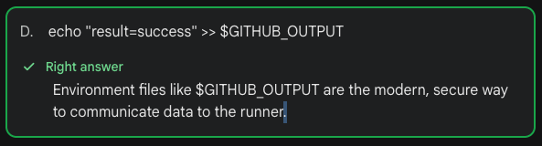

2. In a Composite Action, you have a step that needs to run a bash script. Which of the following is true regarding the 'shell' property?

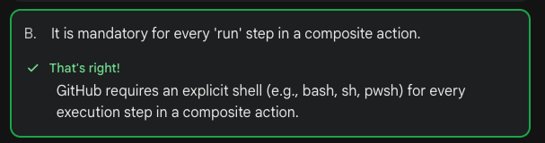

3. When publishing an action to the GitHub Marketplace, what is the purpose of the 'branding' section in the action.yml?

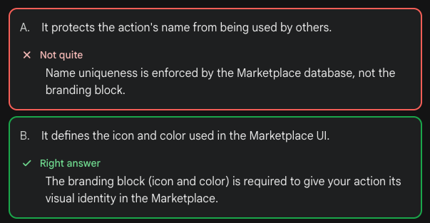

4. What happens if a JavaScript action is published to the Marketplace but the 'dist/' folder is excluded via .gitignore?

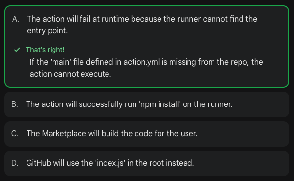

5. You are building a Composite Action that needs to pass a multi-line Terraform plan output to a subsequent step. Which syntax correctly implements the required delimiter to prevent truncation or shell errors?

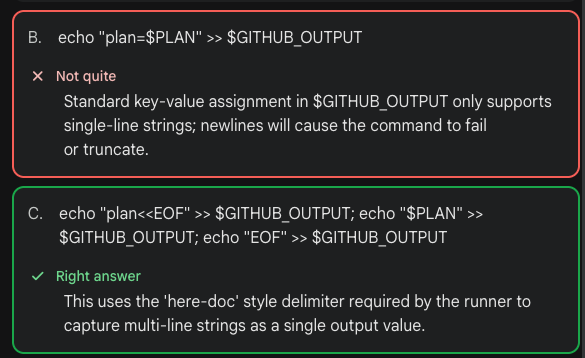

6. You have a JavaScript action that performs a security scan. You want to highlight a specific line in a file as an 'error' directly in the GitHub PR UI. Which workflow command should your action's script emit?

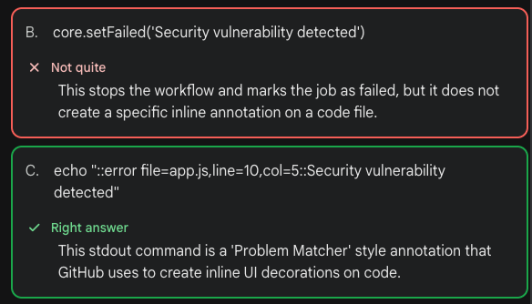

7. In a JavaScript action, you use 'core.getInput('my_input')'. If the user does not provide this input in their workflow, and no default is set in 'action.yml', what is the resulting value in your script?

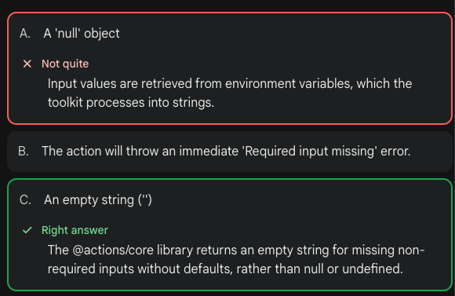

8. When building a Composite action, you find that your shell scripts are failing because a required binary in a sub-folder isn't found. How can you fix this for all subsequent steps in the action?

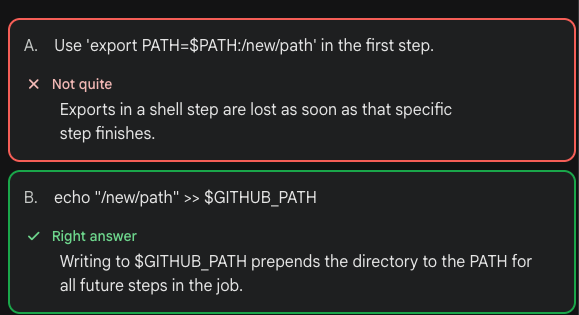

9. You want to organize your logs by collapsing a long list of environment variables into a single clickable section. Which command should you use?

 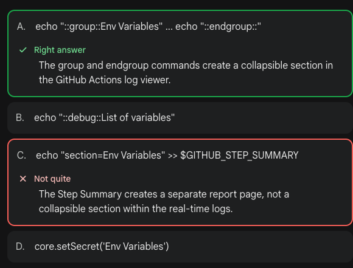

 10. Which of the following describes a 'Composite' action's execution environment?

 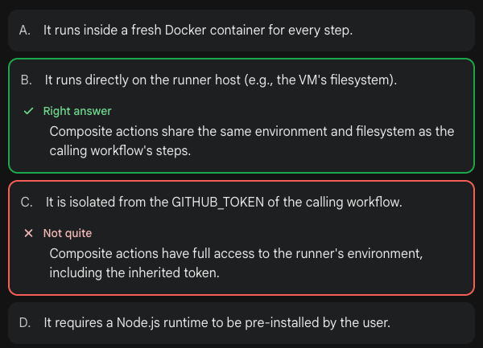

 11. You have a JavaScript action that needs to access a user-provided secret. In your 'action.yml', the input is defined as 'api-key'. Which code snippet is the correct way to retrieve this value securely using the standard toolkit?

 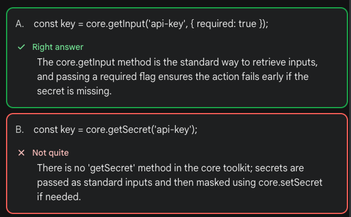

 12. You are building a Docker Action. You want to pass a large JSON string from the container back to the calling workflow. How should the Docker container communicate this data?

 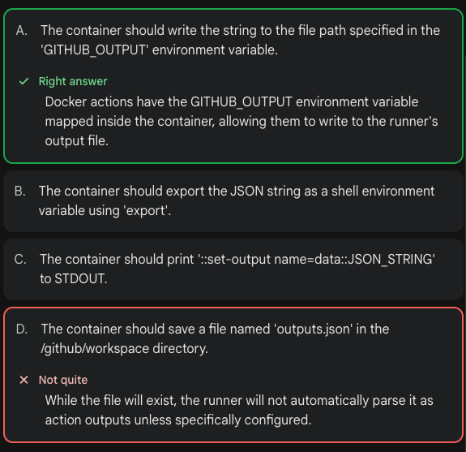

 14. When developing a JavaScript action, you want to include a 'post' script that runs at the end of the job to clean up temporary files, even if the main action failed. Where is this defined?

 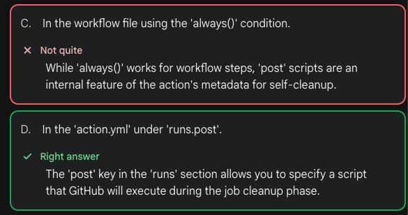

 15. A Docker Action's 'action.yml' defines an input called 'work-dir'. How is this value made available to the code running inside the container?

 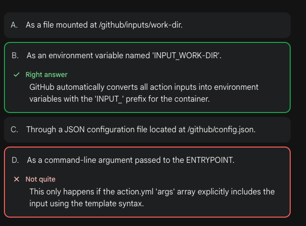

 16. You want to conditionally run a step in a Composite action only if a previous step in that same action failed. How do you check the status of a specific step inside action.yml?

 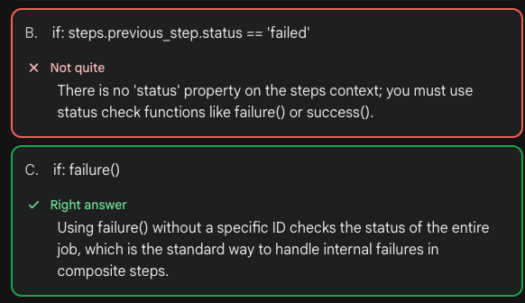

17. You are building a new custom action and must pass data from one step to subsequent steps in a GitHub Actions workflow. Which key should you use in the action's metadata syntax?

A: Outputs

The correct key to use in the action's metadata syntax for passing data from one step to subsequent steps in a GitHub Actions workflow is 'outputs'. This key allows you to define output parameters in your custom action that can be used by other steps in the workflow.

```text
If the question mentions "Metadata" or "action.yml", the answer is almost always inputs or outputs.
If the question mentions "Shell Script" or "Workflow Run", the answer is usually
$GITHUB_OUTPUT or $GITHUB_ENV.
```
[https://docs.github.com/en/actions/creating-actions/metadata-syntax-for-github-actions](https://docs.github.com/en/actions/creating-actions/metadata-syntax-for-github-actions)

18. How can you access an environment variable corresponding to an input in a Docker container action?

A: use the args keyword in the action metadata file to pass the input to the Docker container

```text
Using the args keyword in the action metadata file allows you to pass the input value as an argument 
to the Docker container. This argument can then be accessed within the container as an environment variable, 
enabling you to retrieve the corresponding input value efficiently.
```
[https://docs.github.com/en/actions/creating-actions/metadata-syntax-for-github-actions#example-specifying-inputs](https://docs.github.com/en/actions/creating-actions/metadata-syntax-for-github-actions#example-specifying-inputs)

19. You are trying to run a new Docker container action but getting a permission denied error when running the entrypoint.sh script. How can you resolve this?

A: modify the entrypoint.sh script to explicitly set executable permissions before running

```text
Modifying the entrypoint.sh script to explicitly set executable permissions before running will resolve
the permission denied error. By setting the executable permissions, the script will be allowed to run 
as intended within the Docker container action.
```
[https://docs.github.com/en/actions/creating-actions/dockerfile-support-for-github-actions](https://docs.github.com/en/actions/creating-actions/dockerfile-support-for-github-actions)

20. What information is essential when drafting a new release and publishing an action to GitHub Marketplace?

A: the action’s metadata file’s category must match an existing GitHub Marketplace category

```text
When drafting a new release and publishing an action to GitHub Marketplace, it is essential that the action's 
metadata file's category matches an existing GitHub Marketplace category. This ensures that the action is listed
in the correct category for users to discover and use effectively.
```
[https://docs.github.com/en/actions/creating-actions/publishing-actions-in-github-marketplace](https://docs.github.com/en/actions/creating-actions/publishing-actions-in-github-marketplace)

21. What capability does GitHub provide to enable runners to download actions from internal or private repositories, ensuring access control and security?

A: GitHub creates a scoped installation token with read access to the repository, automatically expiring after one hour

```text
GitHub provides runners with a scoped installation token that has read access to the repository where 
the actions are stored. This token is automatically generated and expires after one hour, ensuring access control 
and security by limiting the duration of access to the actions.
```
[https://docs.github.com/en/actions/creating-actions/sharing-actions-and-workflows-with-your-organization](https://docs.github.com/en/actions/creating-actions/sharing-actions-and-workflows-with-your-organization)