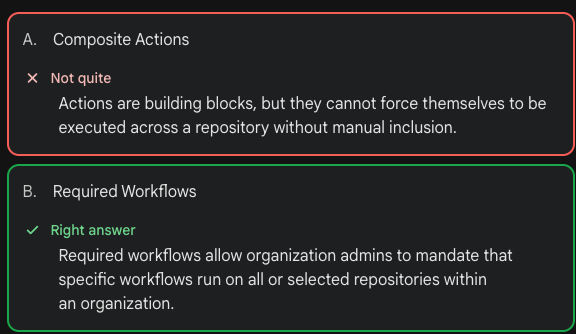
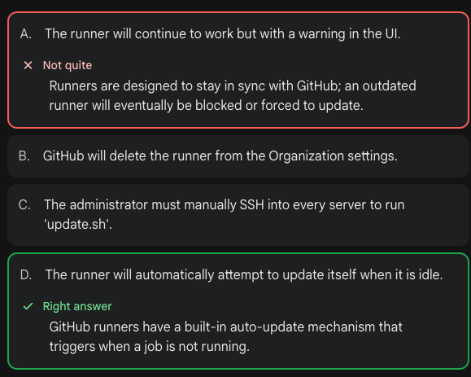
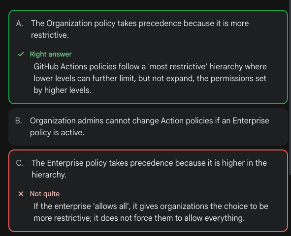
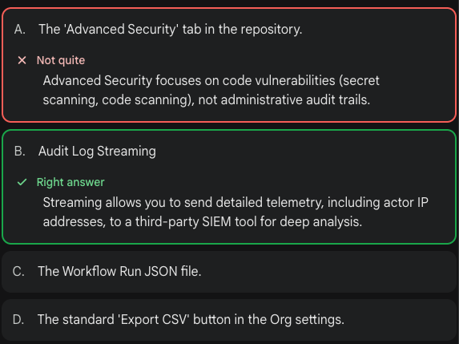
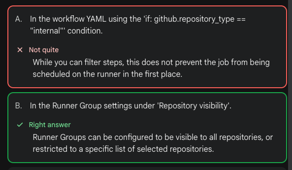
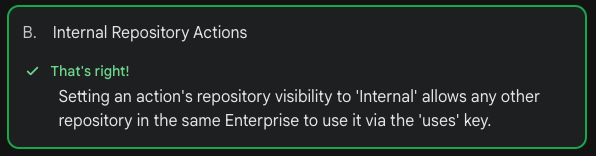

[Github cert](github-cert.md)

# 🗺️ Architecture Mapping (GH-200 to Industry)

When I learned the GH-200, I focused on architectural patterns that are platform-agnostic:

1. **The Orchestration Pattern:** Centralizing logic to reduce "YAML sprawl" in application repos (Called 'Reusable Workflows' in GH, 'Parent-Child Pipelines' in GitLab).
2. **Immutable Infrastructure:** Ensuring builds are reproducible by using Docker-based actions and SHA-pinned dependencies.
3. **Automated Governance:** Using compliance gates to ensure security scans run automatically, regardless of the platform’s specific runner type.

# Domain 4: Enterprise Management

## 🛡️ SHA Policy Inheritance & Recursive Enforcement

In a professional environment, security policies are "Execution-Time" checks, not "Source-Time" checks.

| Scenario | Org/Repo Policy | Action Code | Result |
| :--- | :--- | :--- | :--- |
| **Direct Call** | SHA Required | `uses: action@v4` | ❌ Blocked |
| **Composite Call** | SHA Required | `uses: my-org/my-action@SHA` | 🔍 Investigating... |
| **Nested Step** | SHA Required | `  uses: actions/cache@v4` | ❌ Blocked |

### 💡 The "Trust" Logic
The `ExternalRepo` says: "I don't trust any code that isn't pinned." Since a Composite Action is just a collection of scripts and actions being 'pasted' into the runner, the `ExternalRepo` applies its rules to every single line of that 'pasted' code.

### ✅ The Solution
To make a Centralized Action compatible with "High Security" subscriber repos, the Central Repo must **voluntarily** use SHAs for all internal steps, even if its own policy doesn't require it.

# 🧹 Cache Management & Governance

While caching speeds up builds, it requires monitoring in an enterprise environment to stay within limits.

## 1. Storage Limits
* **Quota:** 10GB per repository.
* **Eviction Policy:** Once the 10GB limit is reached, GitHub automatically deletes the oldest caches to make room for new ones (Least Recently Used / LRU).
* **Retention:** Caches are automatically deleted if not accessed for **7 days**.

## 2. Accessing the Cache UI
* **Path:** `Actions` -> `Management` (left sidebar) -> `Caches`.
* **Purpose:** Use this screen to manually delete corrupted caches or free up space if you notice "Cache Eviction" happening too frequently.

## 3. The GitHub CLI (`gh`) Approach
As a DevOps engineer, you might prefer the terminal for bulk management:

# 🏗️ Architectural Pivot: File-Sync vs. Action-as-a-Service

As a DevOps Engineer, moving from managing individual `.github/workflows` files to centralized Actions is a major "Maturity Level" upgrade.

## ⚖️ Comparison Matrix

| Feature | File-Sync Pattern (Previous) | Action-as-a-Service (Current Lab) | The "Senior DevOps" Win |
| :--- | :--- | :--- | :--- |
| **Logic Delivery** | Terraform "Pushes" `.yml` files to 100+ repos. | Repos "Pull" logic via `uses: automations/action@SHA`. | **Maintenance:** Fix a bug in 1 repo vs. 100 repos. |
| **Tamper Resistance** | Developers can edit/delete the local `.yml` file. | Logic is "Black-Boxed" inside the Composite Action. | **Compliance:** Ensures the Security Scan *actually* runs as intended. |
| **Secret Surface Area** | Secrets are copied/duplicated to every repository. | Centralized OIDC or Org-level Secret access. | **Security:** If a key rotates, you update it in 1 place, not 100. |
| **Version Control** | Every repo must be on the same "Sync" cycle. | Repos can pin to specific SHAs/Tags of the Action. | **Stability:** Teams can upgrade to the "New Build Logic" at their own pace. |
| **Drift Management** | Requires frequent TF runs to "re-sync" changed files. | Zero Drift. The source of truth is the `AutomationsRepo`. | **Reliability:** No "Ghost changes" in hidden workflow files. |

---

## 🛠️ The "Polymorphic" Strategy (Action-as-a-Service)

Instead of having a `node-ci.yml` and a `dotnet-ci.yml`, you build a **Smart Action** that detects the environment.

### The Evolution of the "Smart-Setup"
1. **Old Way:** Terraform copies `node-setup.yml` if the repo is tagged "Node".
2. **New Way:** Your `smart-setup` composite action uses a shell script to check for files:
   - `if [ -f package.json ]; then run npm ci; fi`
   - `if [ -f *.csproj ]; then run dotnet restore; fi`

## 🎯 GH-200 Domain Link: 3 & 4
* **Domain 3 (Actions):** Focuses on creating these "Black-Box" tools that abstract complexity.
* **Domain 4 (Enterprise):** Focuses on "Enforced Policies" where you require these Actions to be used across the whole Organization.

# 🧨 The "Cut Cord" Problem: Templates vs. References

When managing 100+ repos, you must choose between **Flexibility** (Templates) and **Control** (References).

## 1. Starter Workflows (Flexibility)
* **Mechanism:** Copy-on-creation.
* **The "Warning" Problem:** None. The developer owns the file now.
* **Maintenance:** Manual. You must use Terraform or a script to "Force-Push" updates to 100 repos.
* **Use Case:** "Example" workflows or non-critical tasks.

## 2. Reusable Workflows (Control)
* **Mechanism:** Referencing a remote file via `uses:`.
* **The "Warning" Problem:** Automated via **Dependabot**.
* **Maintenance:** Centralized. Update the code in the `AutomationsRepo` and it applies to everyone.
* **Use Case:** Security Gates, Production Deploys, and Compliance.

## ⚖️ The "Hybrid" Best Practice
Keep the YAML in the developer's repo as a "Skinny Caller."
* **The Developer's File:** Only contains `on: push` and 5 lines of code calling your Reusable Workflow.
* **The Logic:** 100% inside your `AutomationsRepo`.

# 📉 Handling Template Drift

When developers own a copy of a workflow file, the "Source of Truth" becomes fragmented. 

## 🛡️ Level 1: The "Skinny Caller" (Prevention)
* **Goal:** Reduce the developer's YAML to < 10 lines.
* **Mechanism:** Use `uses: C11R11/AutomationsRepo/.github/workflows/node.yml@v1`.
* **Benefit:** Since 99% of the code lives in your repo, you can change the "Template" (add steps, change logic) and the developer gets the update instantly without touching their file.

## 🔍 Level 2: The "Checksum" Check (Detection)
* **Goal:** Warn developers if they modified the "Standard" YAML.
* **Mechanism:** A CI step that runs a `diff` between the local `.github/workflows/main.yml` and a "Master" file in the `AutomationsRepo`.
* **Action:** Fail the build or post a "Warning" if the files don't match.

## ⚡ Level 3: Required Workflows (Enforcement - GHE Only)
* **Goal:** 100% Control.
* **Mechanism:** The Organization "Injects" the workflow at runtime. 
* **Benefit:** The developer has **zero** YAML files in their repo. They cannot see, edit, or delete the logic. You have 100% certainty that the latest "Template" is running.

# 🚀 Scaling GitHub Actions: Two Paths to Governance

| Feature | The "Bootstrap" (Free/Team) | The "Injection" (Enterprise) |
| :--- | :--- | :--- |
| **Effort** | Developer must add 1 "Skinny" file. | Zero effort from developers. |
| **Control** | High. You manage the "Orchestrator." | Absolute. You enforce via Org Policy. |
| **Update Path** | Update the Orchestrator in the Central Repo. | Update the Policy in the Org Settings. |
| **Risk** | Developer can delete the "Bootstrap" file. | Developer cannot see or stop the workflow. |

## 💡 The "DevOps Rule of One"
If you have to manage more than **one** file in a remote repository, your abstraction is leaking. Move the extra files into nested `workflow_call` logic in your central repository.

# 🚀 GH-200: Final Mastery Cheatsheet

## 1. The Policy Hierarchy (Cascading Rules)
* **Most Restrictive Wins:** Policies can only be narrowed at lower levels, never widened.
* **Enterprise Account (EA):** Sets the "Ceiling."
* **Organization:** Can further limit (e.g., EA allows "Verified," Org limits to "GitHub only").
* **Logic:** If EA allows "Any action," an Org can still choose to allow "No actions."

## 2. Environment Persistence & "Magic Files"
* **Step Isolation:** Every `run:` block is a new shell. `export` commands do **not** persist.
* **The Big Three:**
    * **Variables:** `echo "KEY=VAL" >> $GITHUB_ENV`
    * **Binaries:** `echo "/usr/bin/tool" >> $GITHUB_PATH`
    * **Outputs:** `echo "name=value" >> $GITHUB_OUTPUT`
* **Multi-line Output Syntax:**
    ```bash
    {
      echo "JSON_DATA<<EOF"
      cat data.json
      echo "EOF"
    } >> $GITHUB_OUTPUT
    ```

## 3. Governance & Scalability
* **Internal Visibility:** Allows any repo in the **same Enterprise** to access an action via `uses:`, even if the repo is private.
* **Audit Log Streaming:** Use for **IP addresses** and SIEM integration (Splunk/S3).
* **Required Workflows:** Enforces a workflow (e.g., Security Scan) to run on **all** repositories in an Org automatically.

## 4. Self-Hosted Runner Management
* **Labels:** Identify *capabilities* (e.g., `runs-on: [self-hosted, linux, gpu]`).
* **Groups:** Identify *permissions* (e.g., "Only the Prod Repo can access this group").
* **Ephemeral Flag:** `--ephemeral`. Runner unregisters immediately after **one** job. 
* **Auto-Update:** Runners update themselves automatically when idle.

## 5. Billing & Multipliers
* **Linux:** 1.0x
* **Windows:** 2.0x
* **macOS:** 10.0x
* **Storage:** Billed for Artifacts, Packages, and Actions metadata.

---

## 🛠️ Lab Implementation: The "Admin-Action" Bridge

### Step 1: Create an Internal Action (In `my-org/custom-action`)
```yaml
# action.yml
name: 'Enterprise Setup'
description: 'Sets global env and path'
runs:
  using: 'composite'
  steps:
    - run: |
        echo "GLOBAL_TOOL_VERSION=1.2.3" >> $GITHUB_ENV
        echo "::add-mask::${{ inputs.secret_key }}"
      shell: bash
```

### Step 2: Enforce Policy (UI Task)
1. Navigate to **Org Settings** > **Actions** > **General**.
2. Select **Allow select actions**.
3. Add `my-org/custom-action` and `actions/*`.
4. Save.

### Step 3: Verify Persistence (In any other repo)
```yaml
# workflow.yml
jobs:
  test:
    runs-on: ubuntu-latest
    steps:
      - uses: my-org/custom-action@v1
      - name: Check Environment
        run: echo "The version is $GLOBAL_TOOL_VERSION"
```

---

### 💡 Final "Exam-Day" Mental Checks
* **action.yml:** Only place for `branding` and `inputs`.
* **OIDC:** The answer for "Eliminating static cloud keys."
* **always():** Runs even if the job is cancelled.
* **SHAs:** Security choice. **Tags:** Convenience choice.

# Programatic secrets managements

```bash
# Set a repository variable (Non-encrypted)
gh variable set LOG_LEVEL --body "debug" --repo cert-labs-hq/external-repo

# Set a repository secret (Encrypted)
gh secret set DEPLOY_KEY --body "super-secret-string" --repo cert-labs-hq/external-repo

# List them to verify
gh secret list --repo cert-labs-hq/external-repo
```

# Runner management

```bash
# Check the runner status directly on the Mac
./config.sh --version

# View the status of your runner in the Org (using GH CLI)
gh api orgs/cert-labs-hq/actions/runners

# List the most recent diagnostic logs
ls -lt _diag/ | head -n 5

# Stream the 'Worker' log (shows exactly what the runner is doing during a job)
tail -f _diag/Worker_$(date +%Y%m%d)*.log

# Install the runner as a macOS Launchd service
sudo ./svc.sh install

# Start the service (it will now auto-start on boot)
sudo ./svc.sh start

# Check service status
sudo ./svc.sh status

#Disable automatic updates
./config.sh --url <URL> --token <TOKEN> --disableupdate

```

## Runner software information

```sh
echo -e "###  Mac Mini Runner Capabilities\n\n| Tool | Version |\n| :--- | :--- |\n| **OS** | $(sw_vers -productVersion) |\n| **Runner** | $(./config.sh --version | grep "Runner version" | awk '{print $3}') |\n| **Node** | $(node -v 2>/dev/null || echo "Not Installed") |\n| **Git** | $(git --version | awk '{print $3}') |\n| **Docker** | $(docker version --format '{{.Server.Version}}' 2>/dev/null || echo "Not Running") |\n| **Terraform** | $(terraform version | head -n 1 | awk '{print $2}' 2>/dev/null || echo "Not Installed") |" > capability-report.md && cat capability-report.md
```

```yaml
jobs:
  audit-runner:
    runs-on: self-hosted
    steps:
      - name: Check Tool Versions
        run: |
          echo "OS: $(sw_vers -productVersion)"
          echo "Node: $(node -v)"
          echo "Docker: $(docker --version)"
          echo "Toolcache: $AGENT_TOOLSDIRECTORY"
```

# QUIZ FAILS

1. An enterprise wants to ensure that all workflows across 100 repositories use a specific set of security scanning steps without requiring each team to manually update their YAML files. What is the best feature to use?



2. What happens to a Self-Hosted runner if the 'Runner Application' is outdated and a new version is released by GitHub?



3. An Enterprise Administrator sets a policy at the Enterprise Account level to 'Allow all actions'. However, an Organization Administrator within that enterprise wants to restrict their specific Org to 'GitHub-authored actions only'. What is the result?



4. You need to audit which user triggered a workflow that resulted in a large bill. The Organization audit log shows the event, but you need to see the IP address of the actor for a security investigation. Which feature is required to access this level of detail at scale?



5. A team is using a Self-Hosted runner group. You want to ensure that only repositories tagged with 'Internal' can use these runners. Where do you configure this restriction?



6. Which GitHub feature is specifically designed to allow 'Inner-Sourcing' of actions by sharing them across an entire Enterprise without making them public to the world?



7. A developer’s workflow fails on your GitHub-hosted ubuntu-latest runner because a specific tool version is missing. Where is the official place to verify which versions of gh, jq, or docker are currently on that image?

A: Check the actions/runner-images repository release notes.

8. Your Mac Mini is online and the service is running, but a job in external-repo has been "Queued" for 10 minutes. The workflow uses runs-on: [self-hosted, macos, production]. What is the most likely cause?

A: The runner is missing the production label.

The Trap: While a runner being busy (D) can cause a queue, the exam usually tests Labels. If your YAML asks for [self-hosted, macos, production] but your Mac only has [self-hosted, macos], the job will stay "Queued" forever because no runner matches all three requirements.

9. Your company has a strict firewall. You need to allow your self-hosted runner to communicate with GitHub's Actions API. How do you find the specific IP ranges to whitelist?

A: Use the GET /meta endpoint of the GitHub REST API.

The Trap: GitHub’s IP ranges change frequently. You should never hardcode them (C). The official way to get the current list for your firewall is the GET /meta API endpoint (or gh api meta).

https://api.github.com/meta

10. How does the Runner Agent (the software on your Mac Mini) receive updates to its core code (e.g., from version 2.311 to 2.312)?

A: It automatically updates itself when a new version is released by GitHub.

The Trap: This is a "Magic" feature of GitHub. The Runner Agent automatically updates itself before it starts a job if a new version is available. You don't have to run a command (C) or a manual script.

11. You want to set a specific environment variable (e.g., NODE_ENV=production) that is available to every job that runs on your Mac Mini, regardless of which repository sent the job. Where is the best place to define this?

A: In the .env file in the runner's root directory.

The Trap: While using "gh variable set" in the org works at the GitHub Actions level, the question asked how to set it for every job that runs on your Mac Mini specifically. If you have two different runners (one Mac, one Linux), and only the Mac needs NODE_ENV=production, you put it in a .env file inside the runner folder. The runner loads this file into the environment before every job.

12. You're using ephemeral runners in containers for your GitHub Actions workflows. However, you've noticed that these runners repeatedly update whenever a new runner version is released, causing disruptions. What action can you take to address this issue?

A: Disable automatic updates 

14. What happens if a job is not approved within 30 days while awaiting review in a workflow?

15. Your team manages its own infrastructure costs using a chargeback model and wants to ensure that development workflows do not utilize the runners paid for by your team. Which GitHub Actions feature can help achieve this goal?

6. You want to limit the use of public actions and reusable workflows so that people can only use reusable workflows in your enterprise. Where would this be configured?

A: In the Policies section for the targeted enterprise for your organization

```text
Configuring the limitation of public actions and reusable workflows to only be used within your enterprise would be done in the Policies section for the targeted enterprise for your organization. This setting allows you to define and enforce specific policies and restrictions related to GitHub Actions usage within your organization.

https://docs.github.com/en/enterprise-cloud@latest/admin/policies/enforcing-policies-for-your-enterprise/enforcing-policies-for-github-actions-in-your-enterprise

https://docs.github.com/en/enterprise-cloud@latest/admin/policies/enforcing-policies-for-your-enterprise/enforcing-policies-for-github-actions-in-your-enterprise#allowing-select-actions-and-reusable-workflows-to-run

```

7. You have created a secret named api_key to use in a workflow that deploys a new application. Which of the following is the correct syntax to reference the secret as an environment variable?

A: 
```yml
steps:
  - shell: bash
    env:
      ENV_API_KEY: ${{ secrets.api_key }}
    run: |
      ./app_install.sh
```

```text
The correct syntax to reference a secret as an environment variable in a GitHub Actions workflow is to use the `${{ secrets.secret_name }}` syntax. In this case, the secret named api_key is referenced as `${{ secrets.api_key }}` within the `env` section of the workflow step. This allows the secret value to be securely accessed and used as an environment variable during the workflow execution.

https://docs.github.com/en/actions/security-guides/using-secrets-in-github-actions#creating-secrets-for-an-environment
```
16. Your organization uses a self-hosted runner deployed within a network that requires a proxy server for internet access. Which environment variable should you configure on the runner to ensure it can successfully communicate with GitHub?

A: https_proxy

```text
The `https_proxy` environment variable should be configured on the self-hosted runner to specify the proxy server that should be used for HTTPS requests. This ensures that the runner can successfully communicate with GitHub over HTTPS through the proxy server.

https://docs.github.com/en/actions/hosting-your-own-runners/managing-self-hosted-runners/using-a-proxy-server-with-self-hosted-runners

```